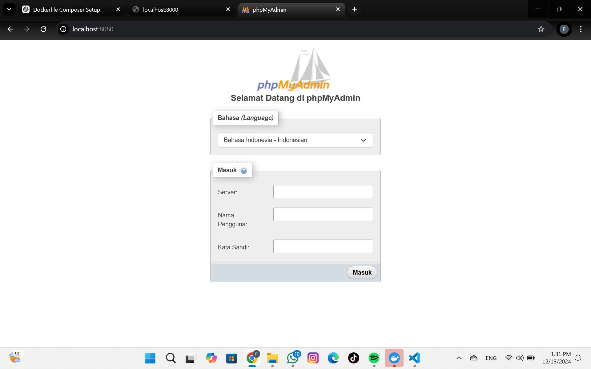
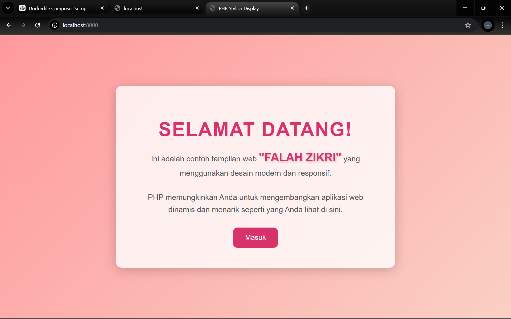

PANDUAN MENJALANKAN DOCKER

Docker adalah platform untuk menjalankan aplikasi dalam container, yang memungkinkan pengembang untuk membuat, mendistribusikan, dan menjalankan aplikasi secara konsisten di berbagai lingkungan. Berikut adalah panduan singkat untuk menjalankan Docker:

1. Instalasi Docker
Windows / macOS:
Unduh Docker Desktop dan ikuti petunjuk instalasi.
Pastikan WSL 2 (untuk Windows) sudah diaktifkan.

2. Periksa Instalasi
Untuk memastikan Docker terinstal dengan benar, jalankan:
docker --version

3. Cobalah menjalankan container uji:

docker run hello-world
Jika berhasil, Anda akan melihat pesan "Hello from Docker!"

# Sebelum menjalankan aplikasi, pastikan Anda sudah mendownload image Docker dengan perintah berikut:

docker pull  

# Gunakan perintah di bawah ini untuk membuat dan menjalankan container Docker:

docker-compose up --build -d  

# Mengakses Aplikasi
1. Akses Web PHP
Setelah container aktif, Anda dapat membuka aplikasi PHP di browser melalui URL:
http://localhost:8000

2. Akses PhpMyAdmin
Untuk memanage database MySQL, buka PhpMyAdmin melalui URL berikut:
http://localhost:8080

# Detail Login PhpMyAdmin:
Server Name: mysql_db
Username: root
Password: awvx0563

# Menghentikan dan Membersihkan Container
Jika Anda ingin menghentikan seluruh container yang sedang berjalan, gunakan perintah berikut:

docker-compose down  

# Tampilan Aplikasi
Berikut adalah tampilan dari web aplikasi:

